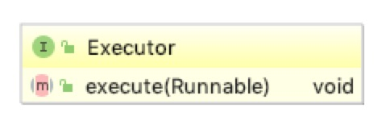
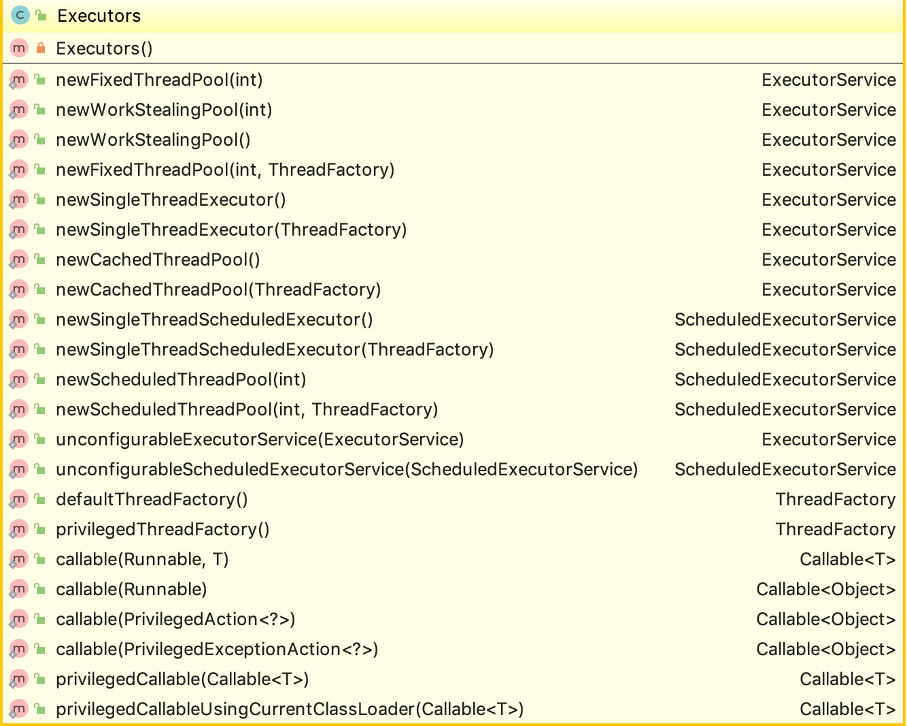

<!-- TOC -->

- [概览](#%E6%A6%82%E8%A7%88)
  - [How About Class](#how-about-class)
    - [1. Executor](#1-executor)
    - [2. ExecutorService](#2-executorservice)
    - [3. AbstractExecutorService](#3-abstractexecutorservice)
    - [4. ThreadPoolExecutor](#4-threadpoolexecutor)
      - [4.1 重要方法解读](#41-%E9%87%8D%E8%A6%81%E6%96%B9%E6%B3%95%E8%A7%A3%E8%AF%BB)
      - [4.2 需要注意的参数(来自源码解读)](#42-%E9%9C%80%E8%A6%81%E6%B3%A8%E6%84%8F%E7%9A%84%E5%8F%82%E6%95%B0%E6%9D%A5%E8%87%AA%E6%BA%90%E7%A0%81%E8%A7%A3%E8%AF%BB)
    - [5. ScheduledExecutorService](#5-scheduledexecutorservice)
    - [6. ScheduleThreadPoolExecutor](#6-schedulethreadpoolexecutor)
    - [7. Executors](#7-executors)
  - [四种线程池](#%E5%9B%9B%E7%A7%8D%E7%BA%BF%E7%A8%8B%E6%B1%A0)
    - [1. NewCachedThreadPool](#1-newcachedthreadpool)
    - [2. NewFixedThreadPool](#2-newfixedthreadpool)
    - [3. NewScheduledThreadPool](#3-newscheduledthreadpool)
    - [4. NewSingleThreadPool](#4-newsinglethreadpool)

<!-- /TOC -->

# 概览

Concurrent包是JDK1.5之后由doug lea开发的。针对Executor接口的等一些列类和方法进行讲解

从上图可以知道Executor为顶层接口，首先我们会对当前的这个结构以及属性方法进行理解，然后针对当前四种不同的线程池实现方式进行讲解

## How About Class

我们当前将依次对

* Executor
* ExecutorService
* AbstractExecutorService
* ThreadPoolExecutor
* ScheduledExecutorService
* ScheduleThreadPoolExecutor
* Executors

类进行讲解

### 1. Executor

Executor是一个接口，当前的顶层接口。

这个接口的实现主要依托于ExecutorService接口，ThreadPoolExecutor扩展了线程池的概念。Executors提供了简单的工厂类去实例化线程池(翻译自接口说明)

### 2. ExecutorService

ExecutorService接口实现了Executor接口，同时扩展了处理能力

提供线程池的能力，比如任务是否完成，所有的线程是否处理掉，等待队列中的线程是否终止等，以及提供统一的接口执行任务调度以及线程的维护

### 3. AbstractExecutorService

这是一个抽象类，提供ExevutorService的默认实现，这个类通过newTaskFor方法返回的RunnableFuture来实现submit和invoke及invokeall方法。他为ThreadPoolExecutor提供了一个主要的脚手架去定制自己的Task取代默认的FutureTask

### 4. ThreadPoolExecutor

一种ExecutorService的实现，它通常使用Executors返回的某一种池化的线程池来执行提交的任务。  
线程池解决了两个问题:由于减少了每个任务的调用开销，它们通常在执行大量异步任务时提供改进的性能，并且它们提供了一种绑定和管理资源的方法，包括在执行任务集合时消耗的线程。每个{@code ThreadPoolExecutor 还维护一些基本统计信息，例如已完成任务的数量。  
为了在各种上下文中有用，这个类提供了许多可调参数和可扩展性钩子。 但是在实际使用中，通常使用Executors提供的方法来初始化数据。当然，如果需要自己配置的话，需要注意以下参数:

#### 4.1 重要方法解读

* execute 方法

<pre>
使用future方式执行一个提交的任务，执行的线程要么新创建一个，要么从线程池中获取。
如果一个任务不能被顺利提交，那么要么是因为线程被关闭掉了，要么是线程池满了。那么在这种情况下会使用拒绝策略
执行分为三步:
1. 如果小于coreSize，那么会新创建线程进行处理。对addWorker的调用以原子方式检查runState和workerCount，因此通过返回false来防止在不应该添加线程时出现的错误警报。
2. 如果提交的任务能够加入到阻塞队列，那么我们依然会检查是否需要添加一个新的线程(因为上次检查之后可能有些线程关闭或者空闲下来了)，如果没有线程来处理，则重新入队，否则启动新的线程进行处理
3. 如果不能加入到阻塞队列，那么我们会尝试新创建一个线程进行处理。如果失败的话，那么就会走拒绝策略
</pre>

#### 4.2 需要注意的参数(来自源码解读)

* core and max pool size

<pre>
当新的任务被提交时，如果当前池中少于coreSize，那么即使池中的连接都处于空闲状态依然会创建新的线程来处理。如果当前池中的线程数大于coreSize小于max size，只有当阻塞队列满了之后才新创建线程。
</pre>

* On-demand construction

<pre>
默认情况下，甚至核心线程最初只在新任务到达时创建并启动，但可以使用方法{@link #prestartCoreThread}或{@link #prestartAllCoreThreads}动态覆盖。 如果使用非空队列构造池，则可能需要预启动线程。
</pre>

* 创建一个线程

<pre>
使用ThreadFactory创建一个线程，如果不特殊指定的话，创建的任务将会使用相同的分组和权限、并且是非守护状态  
如果ThreadFactory在请求时无法创建线程返回null，执行程序将继续，但可能无法执行任何任务。Thread应该拥有修改线程的权限。 如果使用池的工作线程或其他线程不具备此功能权限，服务可能会降级：配置更改可能不会及时生效，关机池可能会保留在可以终止但未完成的状态。
</pre>

* keep-alive time

<pre>
如果当前的线程大于coreSize，那么空闲状态超过keep-alive time之后将会被回收掉。如果设置allowCoreThreadTimeOut为true，那么如果keepAliveTime不为零，那么所有的线程都可能被回收掉
</pre>

* Queuing

<pre>
用于存储提交任务的BlockQueue。此队列的使用与池的size调整交互
1. 如果少于coreSize的线程在运行，那么Executor更愿意新建一个线程
2. 如果大于等于coreSize个线程在运行，那么Executor更愿意查询一个未使用的线程
3. 如果请求不能被缓存，并且处理线程大于等于maxSize，那么这个请求可能被丢弃

用于查询闲置线程的策略有三种:
1. 直接切换:比如SynchronousQueue就是使用这种方式，它将任务直接交给线程处理，而不去保存他们。在这种情况下，如果当前没有可用的线程，那么查询空置线程的任务就会失败，所以就直接创建一个线程。此策略在处理可能具有内部依赖性的请求集时避免了锁定。直接切换的话一般需要不对最大值进行设置以避免任务被拒绝掉。这也可以理解为当命令继续平均到达的速度超过可以处理的速度时，无限制的线程增长。
2. 无界的查询:在使用LinkedBlockingQueue存储并且没有对容量进行预设值，当所有corePoolSize线程忙时，导致新任务在队列中等待。所以在等待队列满之前，队列中只有coreSize个线程在处理。这可能导致  当命令继续以比处理命令更快的速度到达时，无限制的工作队列增长。
3. 有界的查询: 有限队列例如ArrayBlockingQueue与有限maximumPoolSizes一起使用时有助于防止资源耗尽，但可能更难以调整和控制。 队列大小和最大池大小可以相互影响：使用大型队列和小型池，将会导致CPU使用率降低，OS资源和上下文切换开销，但可能导致人为的低吞吐量。 如果任务经常阻塞（例如，如果它们是I / O绑定的），系统可能能够为您提供比您允许的更多线程的时间。 使用小队列通常需要更大的池大小，这会使CPU更加繁忙，但可能会遇到不可接受的调度开销，这也会降低吞吐量
</pre>

* 拒绝策略

<pre>
当Executor关闭时新的请求会被拒绝，同时在队列和线程都繁忙的时候也可能拒绝。总共有四种拒绝策略:
1. AbortPolicy 默认情况，系统抛出一个运行时异常
2. CallerRunsPolicy 由调用线程处理该任务，通常使用正在运行的线程处理当前的请求，这可能降低当前运行效率
3. DiscardPolicy: 丢弃任务，不抛出异常
4. DiscardOldestPolicy: 丢弃队列最前面的任务，然后重新尝试执行任务
</pre>

* 回调方法

<pre>
此类提供在执行每个任务之前和之后调用的{@code protected}可覆盖{@link #beforeExecute（Thread，Runnable）}和{@link #afterExecute（Runnable，Throwable）}方法。这些可以用来操纵执行环境; 例如，重新初始化ThreadLocals，收集统计信息或添加日志条目。 此外，可以重写方法{@link #terminated}以执行Executor完全终止后需要执行的任何特殊处理。
如果回调方法抛异常的话，那么线程可能突然就挂掉了
</pre>

* 队列的存储

<pre>
方法{@link #getQueue（）}允许访问工作队列以进行监视和调试。 强烈建议不要将此方法用于任何其他目的。 当大量排队的任务被取消时，两个提供的方法{@link #remove（Runnable）}和{@link #purge}可用于协助存储回收。
</pre>

* Finalization

### 5. ScheduledExecutorService

提供延迟执行的线程池。

### 6. ScheduleThreadPoolExecutor

继承自ThreadPoolExecutor类，同时实现了ScheduledThreadExecutorService。主要提供了延时执行以及定时周期执行任务的功能

### 7. Executors

这个类其实就是一个工具类，通过工厂模式实现四种线程池的初始化操作。

## 四种线程池

### 1. NewCachedThreadPool

创建一个可以任意开辟新线程的线程池，但是可以重用之前创建的线程。这种线程池可以很好的提高短期异步线程的效率。

底层存储: SynchronousQueue 是一种极为特殊的阻塞队列，它没有实际的容量,但是由于该Queue本身的特性，在某次添加元素后必须等待其他线程取走后才能继续添加；可以认为SynchronousQueue是一个缓存值为1的阻塞队列，但是 isEmpty()方法永远返回是true，remainingCapacity() 方法永远返回是0，remove()和removeAll() 方法永远返回是false，iterator()方法永远返回空，peek()方法永远返回null。

### 2. NewFixedThreadPool

创建一个线程池，该线程池重用在共享的无界队列中运行的固定数量的线程,在任何时刻，都只有最多coreSize的线程保持活跃。如果当前所有的线程都处于繁忙状态，新提交的任务会存入到阻塞队列中，直到有可用的线程为止。如果在执行任务的过程中有线程挂掉了，那么会新生成新的线程进行处理。线程池的线程就一直保持存在，直到线程池退出。

底层存储: LinkedBlockingQueue 基于链表的阻塞队列，内部维持着一个数据缓冲队列（该队列由链表构成）。当生产者往队列中放入一个数据时，队列会从生产者手中获取数据，并缓存在队列内部，而生产者立即返回；只有当队列缓冲区达到最大值缓存容量时（LinkedBlockingQueue可以通过构造函数指定该值），才会阻塞生产者队列，直到消费者从队列中消费掉一份数据，生产者线程会被唤醒，反之对于消费者这端的处理也基于同样的原理。

### 3. NewScheduledThreadPool

创建一个可以执行延迟命令或周期任务的线程池

底层存储:DelayedWorkQueue 优先级队列都是通过堆这种方式可以快速实现优先级队列，它的插入和删除操作的效率都是O(log N)。

### 4. NewSingleThreadPool

创建一个Executor，它使用一个在无界队列，这个队列中只有一个worker线程。(强调:如果当前线程挂掉了，那么会启动一个新的线程处理请求)。保证任务按顺序执行，并且在任意时刻都只有一个线程在处理。这与newFixedThreadPool(1)不一样，他不能对返回的线程进行重新的配置。

构造函数返回的对象其实是一个FinalizableDelegatedExecutorService，通过源代码可以得出以下结论:  

1. 单线任务处理的线程池
2. shutdown方法必然会被调用
3. 不具备ThreadPoolExecutor所有功能的线程池

底层存储: LinkedBlockingQueue 基于链表的阻塞队列，内部维持着一个数据缓冲队列（该队列由链表构成）。当生产者往队列中放入一个数据时，队列会从生产者手中获取数据，并缓存在队列内部，而生产者立即返回；只有当队列缓冲区达到最大值缓存容量时（LinkedBlockingQueue可以通过构造函数指定该值），才会阻塞生产者队列，直到消费者从队列中消费掉一份数据，生产者线程会被唤醒，反之对于消费者这端的处理也基于同样的原理。